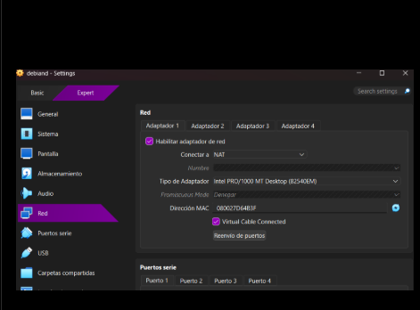
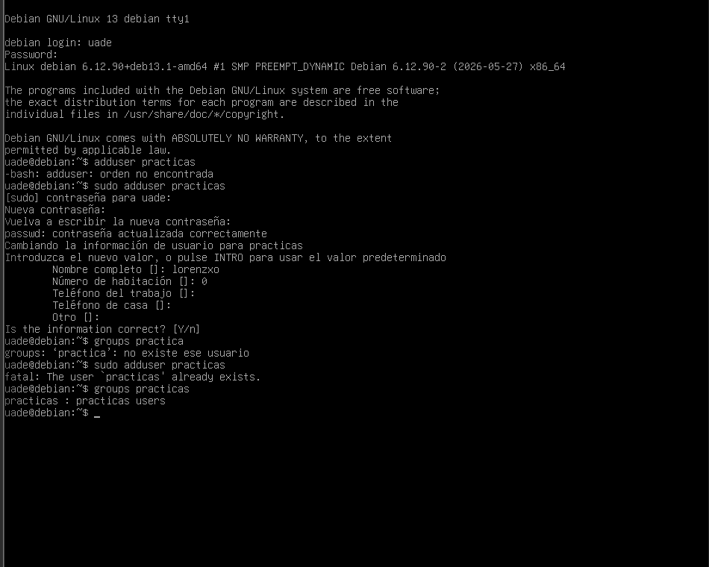
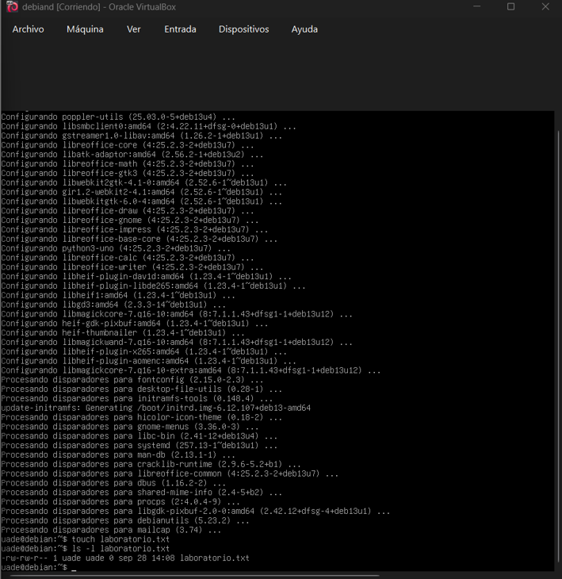
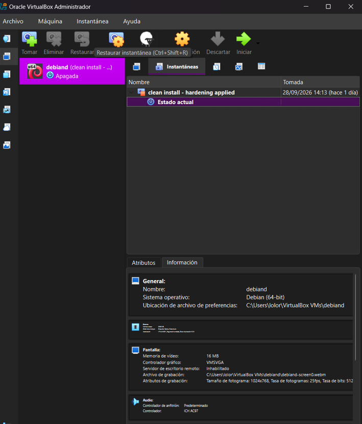

# Checkpoint 1 — Mi primer laboratorio seguro de ciberseguridad

## Reporte Técnico de Configuración de Laboratorio

**Máquina virtual:** Debian GNU/Linux 13 (64-bit)  
**Hipervisor:** Oracle VirtualBox  
**Red:** NAT  
**Usuario de trabajo:** `uade`

---

## 1. Fundación: VirtualBox y red aislada

La máquina virtual fue configurada en VirtualBox utilizando el modo **NAT**.

El modo NAT permite que la máquina virtual tenga conectividad de red para descargar actualizaciones y herramientas, pero evita que la VM quede directamente expuesta como un equipo independiente dentro de la red local del host. Esto reduce la superficie de exposición durante las prácticas.

**Evidencia:**



---

## 2. Capa Linux: usuario de trabajo

El laboratorio se realizó sobre Debian GNU/Linux. La sesión utilizada corresponde al usuario **uade**, visible en el prompt de la terminal como `uade@debiand`.

La práctica se realiza desde una cuenta de trabajo y no desde una sesión `root`, siguiendo el principio de menor privilegio. La evidencia disponible muestra la sesión iniciada con `uade`.

**Evidencia:**



---

## 3. Mantenimiento y gestión de parches

Se ejecutaron procesos de actualización de paquetes mediante APT. La terminal muestra la descarga y configuración de paquetes del sistema, incluyendo componentes del kernel y aplicaciones.

Mantener el sistema actualizado permite incorporar correcciones de errores y vulnerabilidades conocidas y constituye una medida básica de mantenimiento de seguridad.

**Evidencia:**



---

## 4. Permisos y gestión de archivos

Se creó el archivo `laboratorio.txt` y se utilizó el comando:

```bash
ls -l laboratorio.txt
```

La salida permite observar los permisos y el propietario del archivo:

```
-rw-rw-r-- 1 uade uade ... laboratorio.txt
```

Esto evidencia el uso de permisos Unix para controlar quién puede leer, modificar o ejecutar un archivo.

La misma captura contiene la evidencia de la actualización del sistema y de la ejecución de `ls -l`.

**Evidencia:**


---

## 5. Red de seguridad: Snapshot inicial

Como punto de recuperación se creó una instantánea de VirtualBox denominada:

**Clean Install - Hardening applied**

La instantánea funciona como un punto de restauración de la máquina virtual. Si durante futuras prácticas una modificación provoca un problema, permite regresar al estado previamente guardado.

**Evidencia:**



---

## Relación con los criterios de evaluación

| Criterio | Evidencia |
|---|---|
| Gestión de Identidades y Privilegios | Usuario de trabajo `uade` y uso de sesión no-root |
| Mantenimiento y Gestión de Parches | Actualización mediante APT |
| Resiliencia y Recuperación | Snapshot **Clean Install - Hardening applied** |
| Calidad del Reporte Técnico | Este documento y organización de evidencias |
| Configuración de Red y Segmentación Local | Adaptador de VirtualBox configurado en **NAT** |

## Conclusión

La máquina de prácticas quedó preparada sobre Debian GNU/Linux dentro de VirtualBox, utilizando NAT, una cuenta de trabajo sin sesión root, actualización de paquetes, control de permisos mediante Unix y un snapshot de recuperación. Estas medidas forman una base segura para continuar con los siguientes laboratorios de ciberseguridad.

> **Nota:** El enunciado permite realizar el laboratorio sobre Windows o Linux y recomienda Linux para ciberseguridad. Por eso este laboratorio se documenta sobre Debian GNU/Linux.
