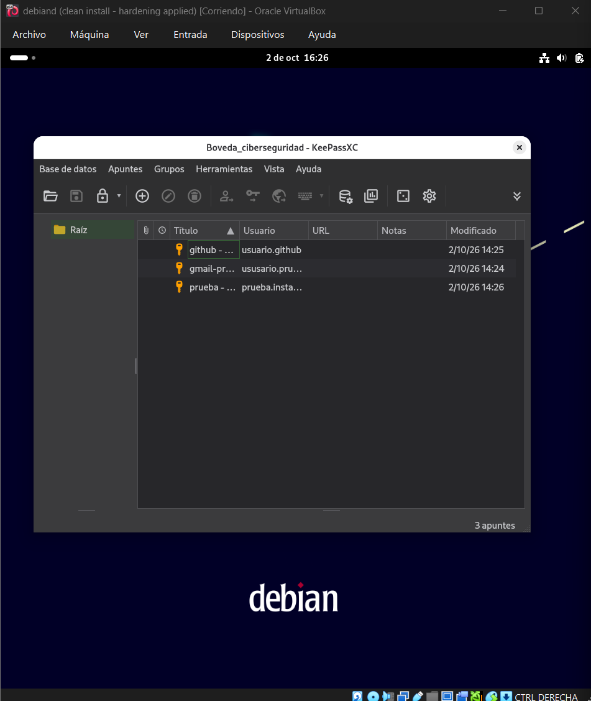
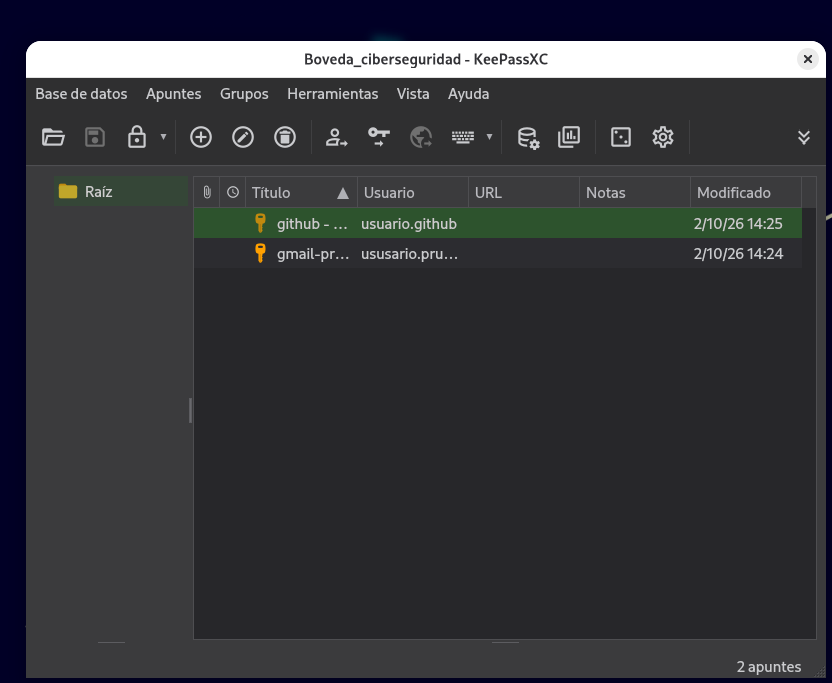
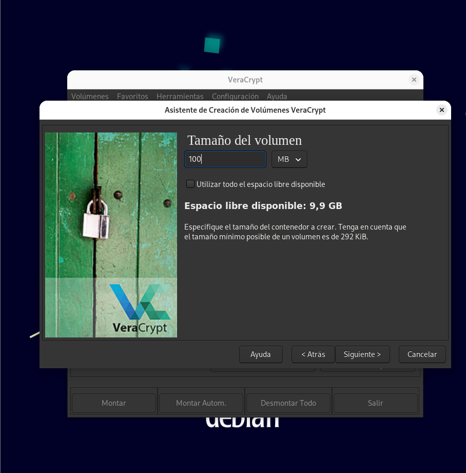
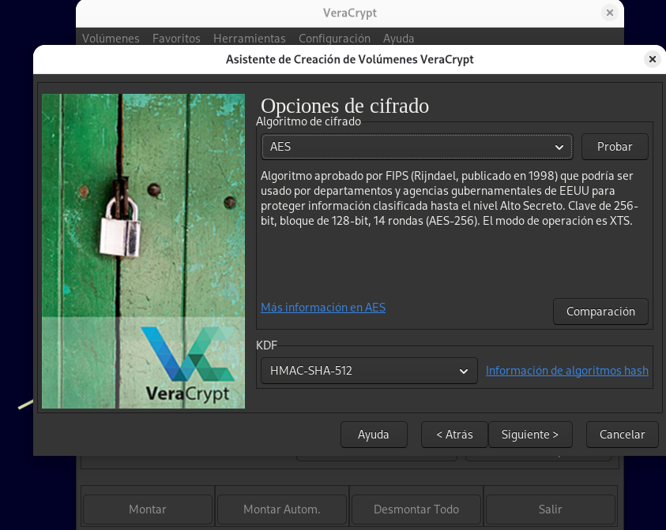
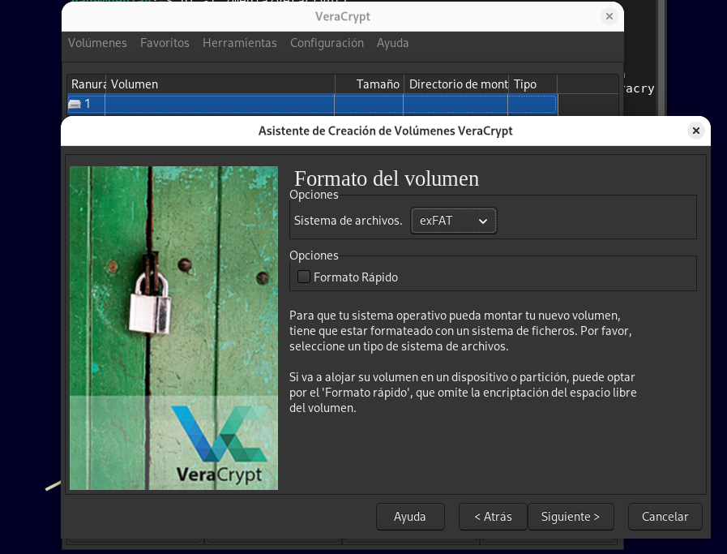
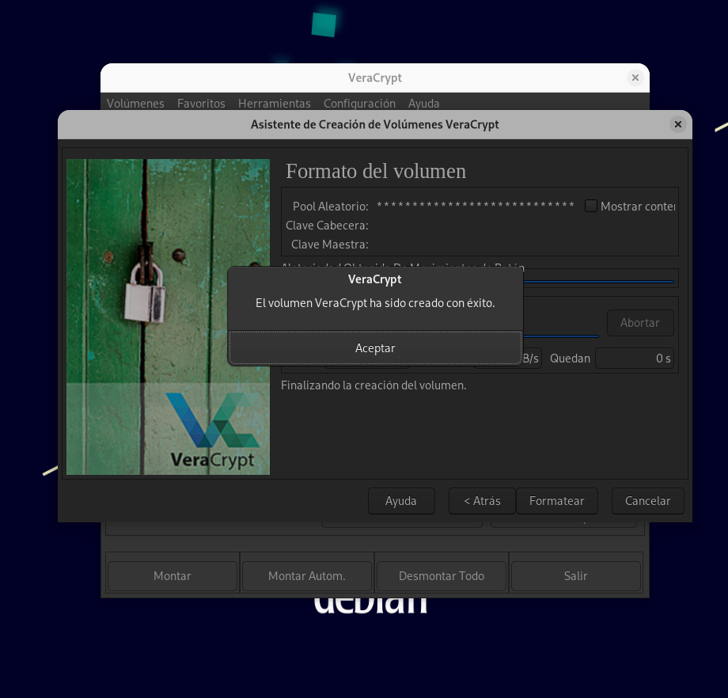
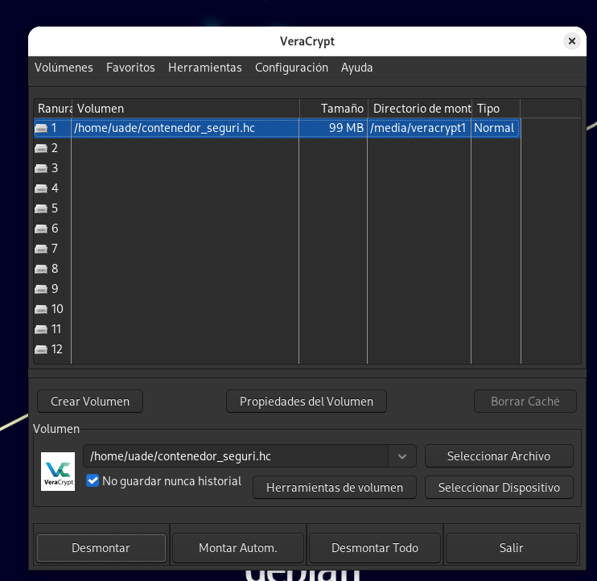
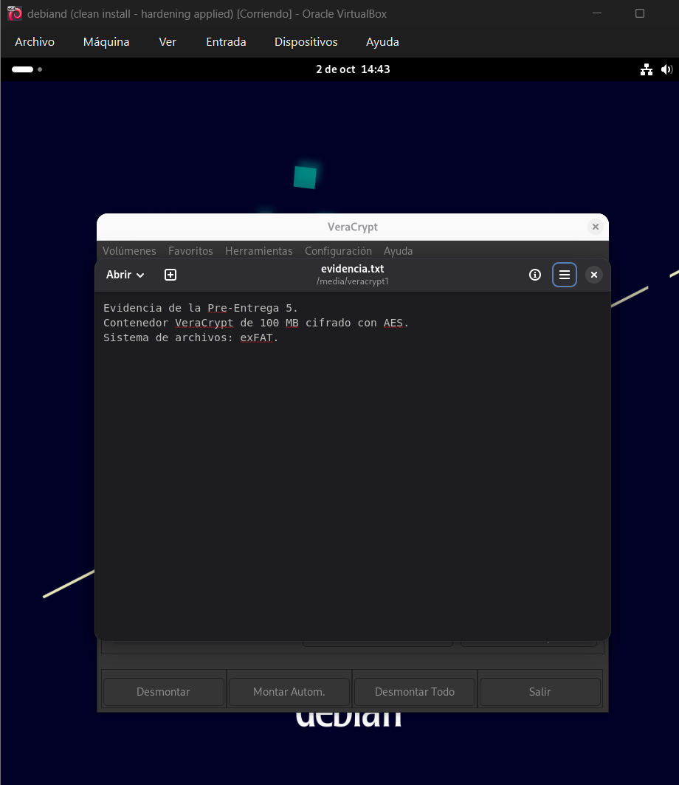
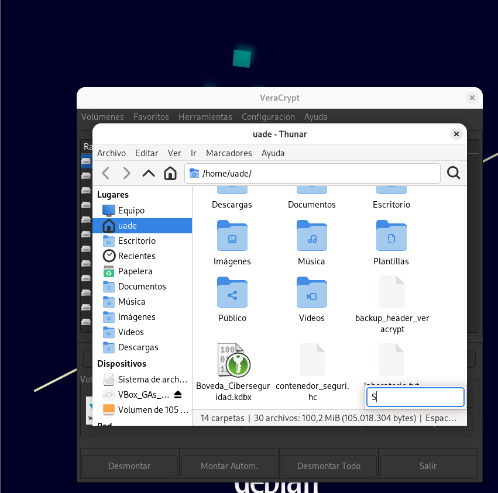
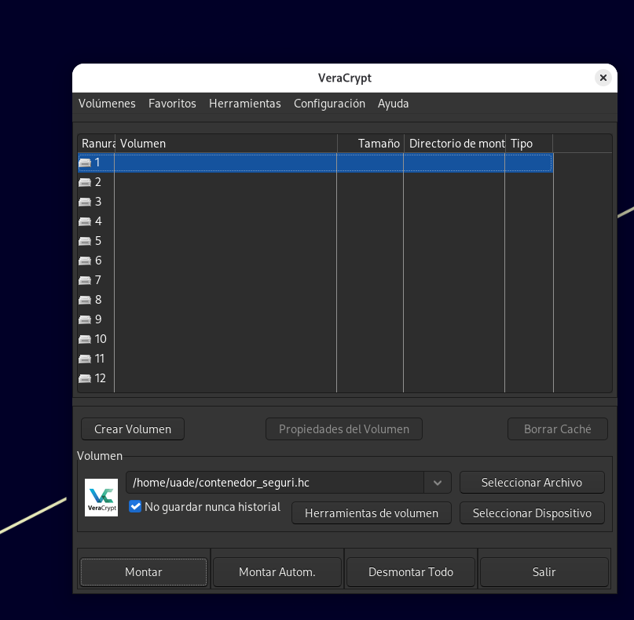

# Pre-Entrega 5 — Mi bóveda y contenedor seguro

## Objetivo

Aplicar mecanismos básicos de protección de credenciales y almacenamiento mediante **KeePassXC** y **VeraCrypt**, documentando la configuración y las evidencias del procedimiento realizado en Debian.

---

## 1. Bóveda de identidad — KeePassXC

### 1.1 Creación de la bóveda y registros

**Qué se hizo:** se creó una base de datos local llamada `Boveda_Ciberseguridad.kdbx`, protegida mediante una contraseña maestra. Luego se agregaron **3 registros de prueba**.

**Para qué:** utilizar una bóveda permite centralizar credenciales y protegerlas mediante una única contraseña maestra.

### 1.2 Generador de contraseñas

**Qué se hizo:** se utilizó el generador interno de KeePassXC para crear contraseñas aleatorias de más de 16 caracteres, utilizando mayúsculas, minúsculas, números y símbolos.

**Para qué:** generar contraseñas aleatorias y complejas ayuda a evitar claves fáciles de adivinar o reutilizar.

---

## 2. Contenedor acorazado — VeraCrypt

### 2.1 Configuración del tamaño

**Qué se hizo:** se configuró un contenedor VeraCrypt con un tamaño de **100 MB**.

**Para qué:** el contenedor funciona como un espacio de almacenamiento cifrado en el que se pueden guardar archivos protegidos.

### 2.2 Selección del algoritmo AES

**Qué se hizo:** durante la creación del volumen se seleccionó **AES** como algoritmo de cifrado.

**Para qué:** AES se utiliza para cifrar la información almacenada dentro del contenedor y evitar que pueda ser leída directamente sin la contraseña.

### 2.3 Sistema de archivos exFAT

**Qué se hizo:** se configuró el volumen utilizando el sistema de archivos **exFAT**.

**Para qué:** permite organizar y almacenar archivos dentro del volumen cifrado.

### 2.4 Creación del volumen

**Qué se hizo:** se completó el proceso de creación del volumen VeraCrypt.

**Para qué:** esta etapa genera finalmente el contenedor cifrado que posteriormente puede montarse para acceder a su contenido.

---

## 3. Uso del contenedor

### 3.1 Montaje del volumen

**Qué se hizo:** se montó el contenedor VeraCrypt para acceder al espacio protegido.

**Para qué:** montar el volumen permite utilizarlo temporalmente como una unidad de almacenamiento mientras permanece protegido por VeraCrypt.

### 3.2 Archivo de evidencia

**Qué se hizo:** dentro del volumen montado se creó el archivo `evidencia.txt`.

**Para qué:** demostrar que se puede guardar información dentro del contenedor una vez que este fue desbloqueado y montado.

### 3.3 Copia de seguridad del encabezado

**Qué se hizo:** se realizó una copia de seguridad del encabezado mediante la opción **Header Backup**.

**Para qué:** conservar una copia del encabezado permite contar con un respaldo para situaciones en las que sea necesario recuperar la información estructural del volumen.

### 3.4 Desmontaje final

**Qué se hizo:** finalmente se desmontó el volumen VeraCrypt.

**Para qué:** al desmontarlo, el contenido deja de estar accesible como unidad montada y vuelve a quedar protegido dentro del contenedor cifrado.

---

## 4. Resumen de evidencias

| Nº | Evidencia | Objetivo |
|---|---|---|
| 1 | KeePassXC con 3 registros | Demostrar la creación de la bóveda y sus registros |
| 2 | Generador KeePassXC | Demostrar la generación de contraseñas aleatorias |
| 3 | VeraCrypt 100 MB | Cumplir el tamaño solicitado |
| 4 | AES | Demostrar la selección del algoritmo de cifrado |
| 5 | exFAT | Demostrar el sistema de archivos solicitado |
| 6 | Volumen creado | Confirmar la creación del contenedor |
| 7 | Volumen montado | Demostrar el acceso al contenedor protegido |
| 8 | `evidencia.txt` | Demostrar el almacenamiento de un archivo |
| 9 | Header Backup | Demostrar la copia de seguridad del encabezado |
| 10 | Volumen desmontado | Finalizar la práctica dejando el contenedor protegido |

## 5. Resultado

La práctica fue realizada en Debian mediante **KeePassXC** y **VeraCrypt**. Se documentaron las principales etapas de creación, configuración, utilización y desmontaje de la bóveda y del contenedor seguro.
